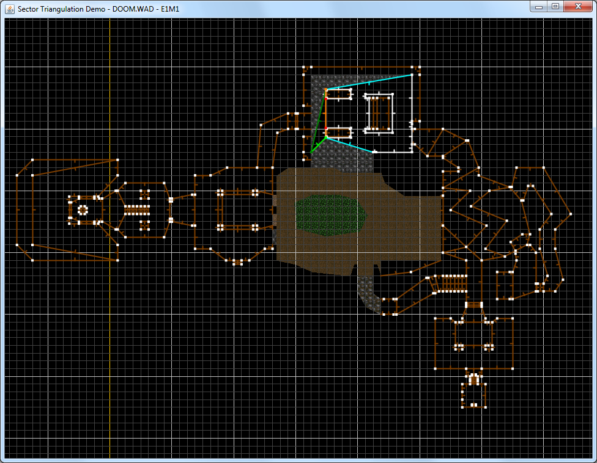

# Doom Sector Triangulation Demo

Program to demonstrate a method of converting sectors of a Doom map into triangles. Triangulation is performed in a delayed manner with the viewport updated after each change.
Various settings, including WADs, map, delays between each action, and more are specified in the config file.

## Requirements

- JDK 8 or newer to build / Java 8 or newer to run
- [Topdown Framework](https://github.com/ElementalHaven/Topdown-Framework) as the core of the rendering & config system

## Controls

- **C**: Reload the config file. All but lighting, the WADs specified, and the current map specified will take effect immediately.
- **E**: Clear/empty/erase the viewport of any map data.
- **R**: Start/restart triangulation of the current map.
- **S**: Suspend/resume triangulation.
- **Mouse Drag**: Move the viewport.
- **Mousewheel**: Zoom in/out.

## Issues

Many IWAD maps, primarily ones in Doom 2 and episode 4 of Ultimate Doom contain unclosed sectors and lines that should be double sided when they aren't.
Because of how Doom's area-based flat rendering works, this isn't really an issue for the original games.
However, this causes massive problems trying to turn the data into a list of triangles. A rudimentary attempt is made at fixing some of these issues, but most cause the program to fail.
The program served my purpose of coming up with an algorithm to turn Doom map data into something usable by a modern graphics API, so I'm leaving it as is for now.
A potential solution I've come up with is rewriting the whole thing to work on the entire map data at once, deciding sector based on the sides as it goes rather than working sector by sector.
That is something that probably won't be done for a while by me, if at all.

## Possible Improvements

- Merging adjacent linedefs with identical properties(or identical with one of them flipped)
- Drawing sky textures where appropriate
- Adding config options for the color of each line type during triangulation (inactive sector, active sector, generated line, starting line, etc)
- The fix for broken IWAD data (and probably a number of old PWADs) mentioned above